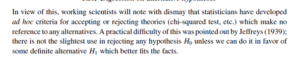
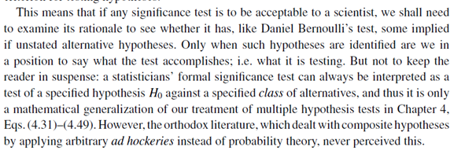
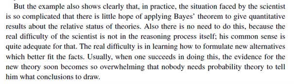
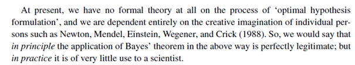
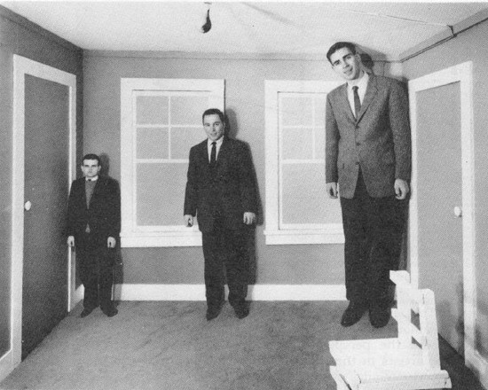
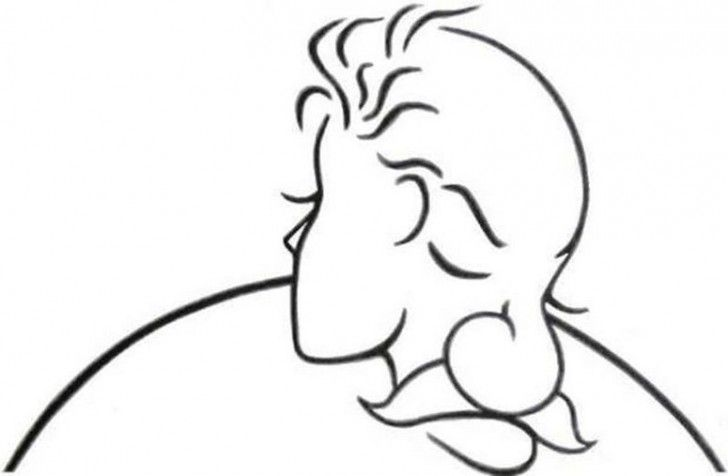

class: title-slide, inverse, left

background-image: url(fig/pt-bookcover.jpg)
background-position: right 50px bottom 25px
background-size: 15%

```{css, echo = FALSE}
.title-slide .remark-slide-number {
  display: none;
}
```

```{r setup, include=FALSE}
options(htmltools.dir.version = FALSE)
library(RefManageR)
```

```{r xaringan-extra-all-the-things, echo=FALSE}
library(xaringanExtra)
xaringanExtra::use_xaringan_extra(
  c("tile_view", "panelset", "editable", 
    "animate", "tachyons")
)

xaringanExtra::use_tachyons()

xaringanExtra::use_extra_styles(
  hover_code_line = TRUE,         #<<
  mute_unhighlighted_code = TRUE  #<<
)

xaringanExtra::use_logo("fig/bl_logo.png",
                        link_url = "https://www.lucs.lu.se/bayes/",
                        position=css_position(top = "2em", right = "2em"))
```

```{r xaringan-themer, include=FALSE, warning=FALSE}
library(xaringanthemer)
style_mono_accent(base_color = "#2a3990",
  header_font_google = google_font("Josefin Sans"),
  text_font_google   = google_font("Montserrat", "300", "300i"),
  code_font_google   = google_font("Fira Mono")
)
```

.h1.f-headline.fw1[
Probability Theory
]

.h2.f-subheadline.lh-title[
The logic of science
]

<br><br><br><br><br>
.f3.lh-title[
Bayes@Lund Book Club<br>Chapter 5
]

---
background-image: url(fig/pt-bookcover.jpg)
background-position: right 50px bottom 50px
background-size: 25%

#Chapter 5. Queer uses for probability theory

---
#Chapter 5. 
The most familiar problems may be so complicated – just because the result depends on so many unknown and uncontrolled factors – that a full Bayesian analysis, although correct in principle, is out of the question in practice

Bayes’ theorem remains the normative principle telling us what we should aim for.

Without it, we have nothing to guide our choices and no criterion for judging their success.

Generations of workers in this field have not comprehended the fact that Bayes’ theorem is a valid theorem required by elementary desiderata of rationality and consistency, and have made unbelievably persistent attempts to replace it by all kinds of intuitive ad hockeries
---
#Examples of queer uses of Bayes-Laplace methods

Normal-approximations 

Hypothesis testing

Mrs Smith's extrasensory perception 

Discovery of Uranus

Test of Newtonian theory

Horce racing and weather forecasts 

Hempel's paradox

---
#Recapitulation 


##Bayes-Laplace reasoning 

Probability: $P(D|HX)$ and $P(D|\overline{H}X)$

Odds: $O(H|DX)=\frac{P(D|HX)}{P(D|\overline{H}X)}$

Evidence: $e(H|X)=10log_{10}O(H|DX)$

An $e$ on -30 db corresponds to a disbelief in $H$

---
#Mrs Stewart extrasensory perception?
.pull-left[
$n = 37100$ trials

Mrs Stewart guessed correctly $r=9410$ times

Random guess (null hypothesis) probability correct in one trial $p=0.2$

Alternative hypothesis is chosen to be "the one with the highest likelihood", i.e. $f = \frac{r}{n}=0.2536$

```{r}
n = 37100 #trials
r = 9410 #correct guesses
1-pbinom(r,n,0.2)
dbinom(r,n,0.2)
```
]

.pull-right[
```{r,echo=FALSE,fig.height=4,fig.align='center'}
n = 37100 #trials
r = 9410 #correct guesses
p0 = 0.2
plot(7000:9500,dbinom(7000:9500,n,p0),type='l',xlab='n',ylab='pdf')
abline(v=r,col='red')
```

```{r}
dbinom(r,n,0.2536)
10*log10(dbinom(r,n,0.2536)/dbinom(r,n,0.2))

```
]
---
#The number of hypothesis matters

##Bayes theorem 

$H_f$ and $H_p$ (the null hypothesis)

$P(H_f|DX)=P(H_f|X)\frac{P(D|H_fX)}{P(D|X)}=\frac{P_fL_f}{P_fL_f+P_pL_p}$

$+$ alternative or deception hypothesis $i=1,...,n$

$P(H_f|DX)=\frac{P_fL_f}{P_fL_f+P_pL_p+\sum P_iL_i}$

Let $L_i \approx L_f$, and $P_pL_p$ is very small, then 

$\sum P_i \ll P_j$

must hold for $H_f$ to be highly plausible.

---
#Deception hypotheses
```{r}
p_f = 10^-30
p_f*dbinom(r,n,0.2536)/(p_f*dbinom(r,n,0.2536)+(1-p_f)*dbinom(r,n,0.2))

p_f = 10^-300
p_f*dbinom(r,n,0.2536)/(p_f*dbinom(r,n,0.2536)+(1-p_f)*dbinom(r,n,0.2))
```
With deception hypotheses, assume equal likelihood and prior probability
```{r}
p_f = 10^-30
p_d = p_f
p_f*dbinom(r,n,0.2536)/(p_f*dbinom(r,n,0.2536)+(1-p_f-p_d)*dbinom(r,n,p0)+
                          (p_d)*dbinom(r,n,0.2536))

```

---
#Deception hypotheses
```{r}
p_f = 10^-30
p_d = p_f
p_f*dbinom(r,n,0.2536)/(p_f*dbinom(r,n,0.2536)+(1-p_f-p_d)*dbinom(r,n,p0)+
                          (p_d)*dbinom(r,n,0.2536))
```

```{r}
p_f = 10^-30
p_d = p_f/10
p_f*dbinom(r,n,0.2536)/(p_f*dbinom(r,n,0.2536)+(1-p_f-p_d)*dbinom(r,n,p0)+
                          (p_d)*dbinom(r,n,0.2536))

```

```{r}
p_f = 10^-300
p_d = p_f
p_f*dbinom(r,n,0.2536)/(p_f*dbinom(r,n,0.2536)+(1-p_f-p_d)*dbinom(r,n,p0)+
                          (p_d)*dbinom(r,n,0.2536))

```

---
#Choosing hypotheses

There is a continuum of alternative hypothesis – using two hypotheses is naïve

When in doubt, use the device of imaginary results (I. J. Good)

Recognition of a seemingly trivial alternative can make many orders of magnitude difference in the conclusions

Assume likelihood for deceptive hypothesis similar to the first alternative hypothesis. If so, the belief in the deceptive must be smaller than the belief in the alternative in order for the posterior probability of alternative to be high. 

To use probability theory calculus, the imaginary alternative and data are to be such that you can calculate the probability $P(D|H)$

---
#Divine Providence

Arbuthnot 1710 studied 82 years of demographic data. More boys than girls were born.

Null hypothesis equal probability for a boy. Possibility -247 db. 

He saw this as evidence for “Divine Providence”. 

This is not a specific hypothesis, because it does not help us to assign any probability for data. 

$H_1 = \overline H_0$ is also not possible for the same reason. 

Without having the probability $P(D|H1)$ of the data on the alternative hypothesis and the prior probabilities of the hypothesis, there is just no well-posed problem and no rational basis for passing judgment. 

Alternatives are needed before we have any rational criterion for testing hypotheses


---
#Adhockery 

*ad hoc* procedures that are in conflict with the rules of probability theory 





---
#Formulating new hypthesis and the use of Bayes-Laplacian methods 





---
#Doubts and confirmation biases

A strong conclusion e.g. good performance of a method to analyse free decay NMR signals, were met with doubts. 

A person may tell the truth and not be believed, even though the disbelievers are reasoning in a rational, consistent, way.

Convergence of beliefs does not always happen in practice. Prejudices seem to be strengthened by new information which ought to have the opposite effect. 

Kahneman and Tversky (1972) concludes that as arguments against Bayesian methods. 

Jaynes shows that probability theory as logic can reproduce and explain this phenomenon
---
# Converging and diverging views
.pull-left[
Three persons A, B and C beliefs that a drug is unsafe. 

A and C are believers in the safety of the drug, B is a disbeliever. 

P(safe) - A: 0.9, B: 0.1, C: 0.9

They have different likelihoods, because they have different views about the reliability of the information provided. 

P(claimed unsafe|safe) - A: 0.01, B: 0.3, C: 0.99
]

.pull-right[
```{r, echo=FALSE,fig.height=5}
prior = c(0.9,0.1,0.9)
lik_unsafe_unsafe = c(1,1,1)
lik_unsafe_safe = c(0.01,0.3,0.99)
post = prior*lik_unsafe_safe/((1-prior)*lik_unsafe_unsafe+prior*lik_unsafe_safe)
df <- data.frame(p=c(prior, post,lik_unsafe_safe, lik_unsafe_unsafe),
                 pl=rep(c('P(safe)','P(safe|D)','P(D|safe)','P(D|unsafe)'),each=3),
                 person=rep(c('Mr A','Mr B','Mr C'),4))
library(ggplot2)
ggplot(df,aes(y=p,x=pl,fill=person))+
  geom_col(position=position_dodge())


```
]
---
#Converging and diverging experts
.pull-left[
Kahneman and Tversky: People are not thinking like the Bayesian principles. 

Jaynes: People are reasoning according to a more sophisticated version of Bayesian inference (with different likelihoods)

The importance of including the relevant background information $S$

$S:=$ fully adequate precautions against error or deception were taken, and Mrs Stewart did in fact deliver that phenomenal performance.
]

.pull-right[

]

---



---



---

#Inference

Seeing is not a direct apprehension of reality, as we often like to pretend. 

Quite the contrary: seeing is inference from incomplete information. 

The failures of perception revealed by the experiments of Ames and Cantrell are not mechanical failures in the lens, retina, or optic nerve; they are reactions of the subsequent inference process in the brain when it receives new data that are inconsistent with its prior information. 

---
#Newtonian theory and the discovery of Uranus
T: Newtonian theory (laws of mechanics and gravitation) 1687

Uranus discovered 1781

Beginning of 1800 observation that Uranus did not follow the path prescribed by the Newtonian theory 

T is false was -50 db. Did not go down, instead…

There must be another planet beyond Uranus whose gravitational pull is causing the discrepancy - An alternative hypothesis down at perhaps -20 db was resurrected 

N: Neptune was found with the help of the predictions made by Leverrier 1846 

Did this increase plausibility for the Newtonian theory? 

It depends entirely on against which specific alternatives we are testing Newton’s theory 

---
#What to blame?

+ Polya - objection against Bayes-Laplace methods, but used a faulty model 

+ RCJ – Richard C Jeffrey (not Sir Harold Jeffreys), Horse racing and weather forecasting, Uncertainty in new information

In the literature there are perhaps 100 ‘paradoxes’ and controversies which are like this, in that they arise from faulty intuition rather than faulty mathematics. 

Someone asserts a general principle that seems to him intuitively right. 

Then, when probability analysis reveals the error, instead of taking this opportunity to educate his intuition, he reacts by rejecting the probability analysis.

---
# Thanks!

Slides created via the R packages [**xaringan**](https://github.com/yihui/xaringan),
[**xaringanExtra**](https://github.com/gadenbuie/xaringanExtra) and [**xaringanthemer**](https://github.com/gadenbuie/xaringanthemer).

The chakra comes from [remark.js](https://remarkjs.com), [**knitr**](http://yihui.name/knitr), and [R Markdown](https://rmarkdown.rstudio.com).

---
# References

Jaynes, E.T., 2003. Probability theory: The logic of science. Cambridge university press.

